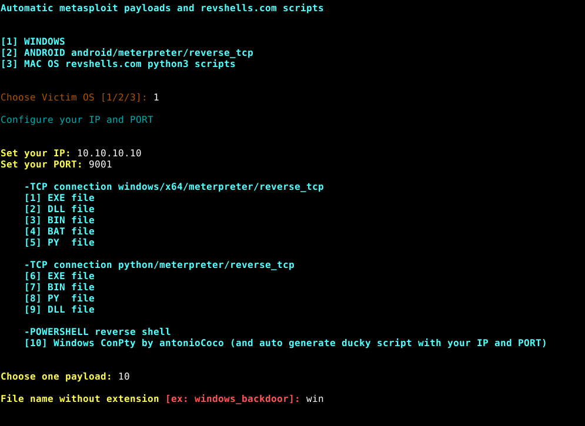
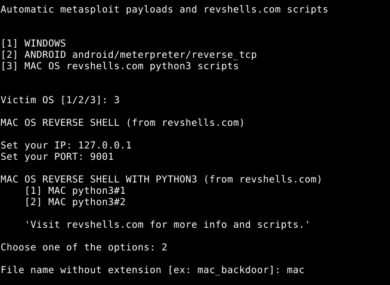

**Disclaimer** : This software is meant for educational purposes only. I'm not responsible for any malicious use of the app.

# GEN-P by stosempreingiro
This is a very simple python script that automate the creation of payloads with msfvenom and some scripts from revshells.com with your ip and port.

## Features of GEN-P
* Fast creation of metasploit payload and revshells script for Windows, Android and MAC OS systems;
* It can create a ducky scripts for windows with your ip and port configuration. (Read the code or try it)


## Prerequisites
GEN-P requiers metasploit-framework and python3 to works.

## Installation
Prerequisites installation:
\\(ignore if you are using Kali or Parrot Security OS)
```
curl https://raw.githubusercontent.com/rapid7/metasploit-omnibus/master/config/templates/metasploit-framework-wrappers/msfupdate.erb > msfinstall && chmod +x msfinstall && ./msfinstall && msfdb init
```
```
sudo apt install git python3 -y
```
Now download the repo and run the script!
```
git clone https://github.com/stosempreingiro/GEN-P.git
cd GEN-P
python3 genp.py
```
## Updates
Updates will coming soon. I hope I'm gonna extend this tool adding obfuscations, other scripts, delay adjustment for ducky script and other android backdoors.

## Examples
* Example list of payloads for windows
<p align="center">
  
</p>

-------------------------------------------------------------------------

* Example list of python3 revshells.com scripts for MacOS
<p align="center">
  
</p>
